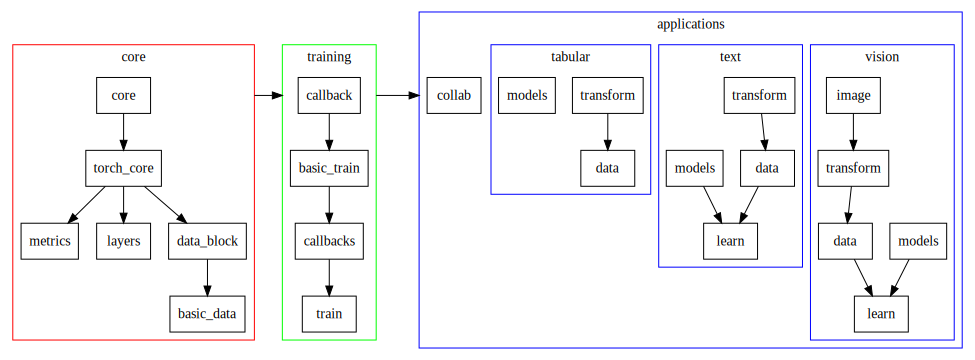

fast.ai course-v3 笔记

## fast.ai 介绍
fastai库可以说是pytorch最佳实践，简化了快速准确的神经网络训练，几乎做到“开箱即用”的支持vision，text，tabular，和collab（协同过滤）的模型，实现了常见的模型结构，诸如resnet34，resnet50等。

## 代码结构

# pre-lesson

## 在哪儿进行fast.ai course-v3的学习呢

[course-v3](https://github.com/fastai/course-v3/tree/master/nbs/dl1) 主体部分是jupyter notebook，因此，需要一台有GPU+jupyter的服务器。

但很多数据集和预训练的模型都在aws或者Dropbox上，如果使用国内的服务器，没有高带宽的ss是很吃亏的。之前在公司的双卡服务器上进行了尝试，1m/s的网速，1080Ti的训练速度，进行lesson1 简直欲仙欲死。

因此推荐几个官方解决方案，在数据获取和模型训练速度上，拥有质的变化。

### CoLab

**优点**：网速飞快，训练飞快

**缺点**：墙，需要梯子。

1.  登录Colab[点击](https://colab.research.google.com/), 点击GITHUB选项卡，输入`fastai/course-v3`，就能加载当前项目的ipynb。
    
2.  修改运行时环境：点击runtime，选择GPU，save。
    
3.  运行` !curl -s https://course.fast.ai/setup/colab | bash`，初始化notebook
    
4.  疯狂点确定。存储备份在自己的drive上。
    

官网参考[here](https://course.fast.ai/start_colab.html)。

### Crestle.ai

参考[crestle.ai](https://course.fast.ai/start_crestle.html)

没使用过

### Kaggle Kernels

优点：只要有kaggle账户就能直接使用，没被墙

缺点：访问速度一般~~；训练速度较慢，K80，据说resnet34 40分钟

参考：[kaggle kernels](https://course.fast.ai/start_kaggle.html)

# lesson 1 What's your pet

图像分类初级课程，快速构建resnet34的图片分类器。

### 数据集说明

[Oxford-IIIT Pet Dataset](http://www.robots.ox.ac.uk/~vgg/data/pets/)，2012年的分类准确率59.21%。

37个不同的宠物类别。

### notebook说明

#### untar_data

把url的数据fname下载并解压到dest。

####  ImageDataBunch

fastai定义的图片数据结构

####  resnet34

cnn中有一些在很多任务上表现很好很稳定的模型结构，例如resnet34，resnet50，我们可以直接使用预定义好的resnet34的模型，进行快速的模型训练。

调用的时候会使用在imagenet预训练好权重的resnet34，进行fine-tune。预训练好的模型是针对1000+类图片进行分类，因此本来就对pet数据会有一定的效果。

验证集验证，error_rate评估_

#### fit_one_cycle

runing code, knows what goes in and what comes out. Run the code, you'd know how it works out.

suggest a potential breakthrough, with more robust language models can help researchers tackle a range of unsolved problems. 

### 参考网站

https://dawn.cs.stanford.edu/benchmark/